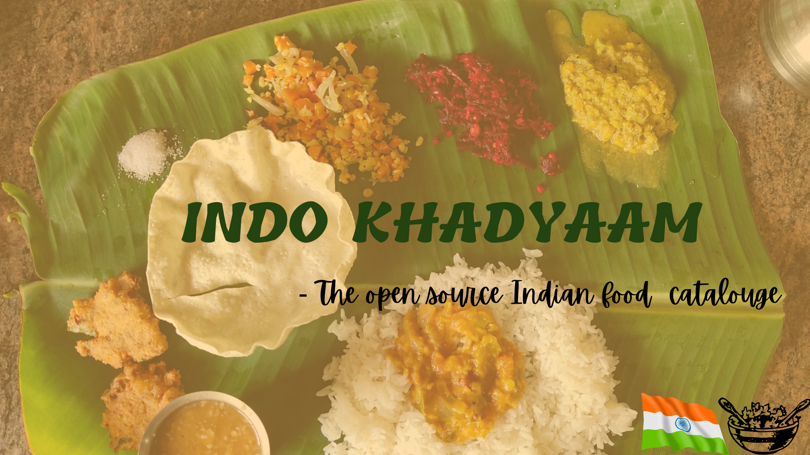

An open source project to catalogue the diverse set of Indian cuisines available across the subcontinent for thousands of years.
We aspire to become the defacto search engine for not only the 1.3B+ people in the nation but also everyone around the world to dive into the univese of Indian food.
Furthermore, we belive that this project can lead to a community where people from all walks of life can share their ancestral or invented recipes without having any obligation to conform to woke trends.

## Tech Stack: [Phase I]

__Frontend__:
 
 - HTML
 - CSS
 - BOOTSTRAP
 - JS
 - REACT
 
 __Backend__:
 
 - Django
 - Mysql
 
 
 
## Project Maintainers👨🏫:

|  |  | 
| :----------------------------------------------------------: | :----------------------------------------------------------: | 
|     [Smaranjit Ghose](https://github.com/smaranjitghose) |    [Anush Bhatia](https://github.com/anushbhatia)                     
